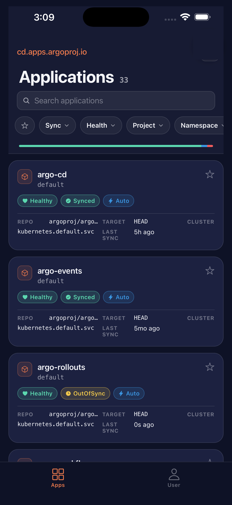

# ArgoCD Mobile

A native iOS and Android app for monitoring and managing [Argo CD](https://argo-cd.readthedocs.io/) deployments from your phone.



[Download on the App Store](https://apps.apple.com/app/id6766354032) · [Get it on Google Play](https://play.google.com/store/apps/details?id=io.akuity.argocd.mobile)

## Features

- Browse all applications with real-time health and sync status
- Filter by sync state, health, project, namespace, and labels (key or key=value)
- Trigger sync, hard refresh, and rollback
- View resource tree, managed resources, and diff
- Stream pod logs with container selection
- SSO login via OIDC/Dex (GitHub, LDAP, SAML, etc.) using PKCE — no stored passwords
- Username/password login as fallback

## SSO Support

The app performs a direct OIDC PKCE flow against your ArgoCD's built-in Dex or an external OIDC provider.

### Dex: register the mobile redirect URI

ArgoCD hardcodes the `argo-cd-cli` Dex static client in [`util/dex/config.go`](https://github.com/argoproj/argo-cd/blob/master/util/dex/config.go) with only `http://localhost` and `http://localhost:8085/auth/callback` as redirect URIs. This list is regenerated on every Dex restart and cannot be overridden via `argocd-cm`. The app's `argocd://auth/callback` URI must be injected after generation.

**Patch the deployment**

This wraps the Dex container command with a background process that re-injects the redirect URI every time ArgoCD regenerates the Dex config:

```bash
kubectl patch deployment argocd-dex-server -n <argocd-namespace> --type=strategic -p '{
  "spec": {
    "template": {
      "spec": {
        "containers": [{
          "name": "dex",
          "command": [
            "/bin/sh",
            "-c",
            "(LAST=\"\"; while true; do M=$(stat -c %Y /tmp/dex.yaml 2>/dev/null); if [ \"$M\" != \"$LAST\" ]; then LAST=$M; grep -q \"argocd://auth/callback\" /tmp/dex.yaml 2>/dev/null || sed -i \"s|  - http://localhost:8085/auth/callback|  - http://localhost:8085/auth/callback\\n  - argocd://auth/callback|\" /tmp/dex.yaml; fi; sleep 0.2; done) & exec /shared/argocd-dex rundex"
          ]
        }]
      }
    }
  }
}'
```

The `exec` keeps `argocd-dex rundex` as PID 1 so it receives Kubernetes signals correctly. The patcher runs in the background and wins the race against Dex startup because it watches for file modification and reacts in under 200ms.

### External OIDC provider

If you use an external OIDC provider (configured via `oidcConfig` in `argocd-cm`), add `argocd://auth/callback` to the allowed redirect URIs in that provider's application settings and set `cliClientID` in `argocd-cm`.

## Development

```bash
yarn install
npx expo start
```

Requires Expo Go or a development build on iOS or Android.
